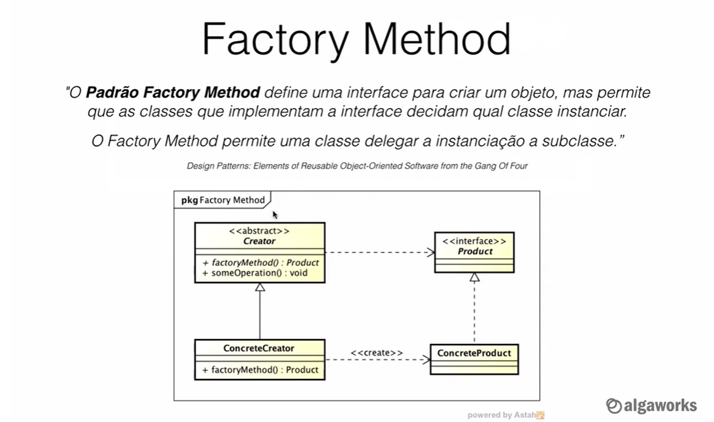
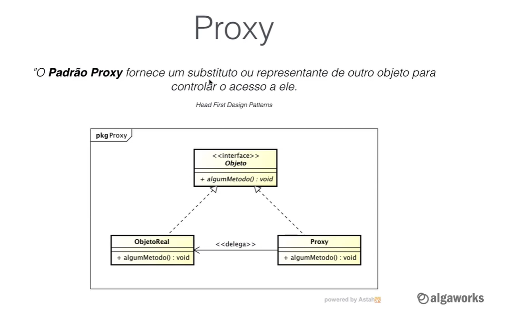
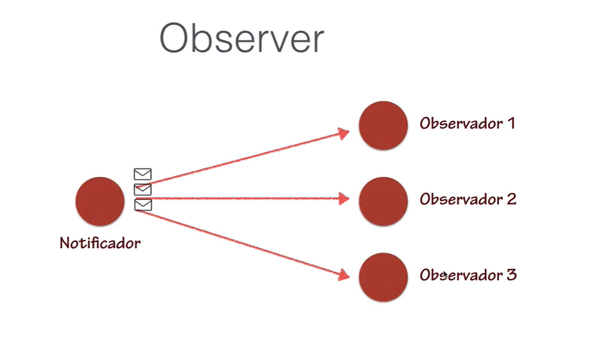
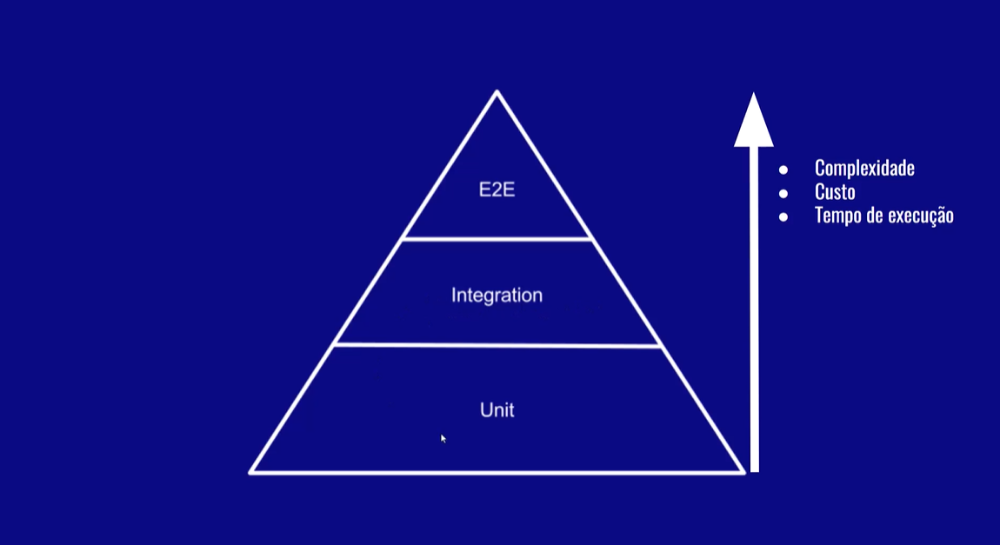

## Princípios do Desenvolvimento (SOLID)

- Single Responsibility
- Open-Closed
- L -
- I -
- D -

### Principais Design Patterns Aplicado com Java

> São códigos para resolver problemas de design comuns, e através
> do "bad smells" são identificados

> **GOF**: Gang of four - Design Patterns: Elements of Reusable
> Object-Oriented Software

- Testes automatizados são utilizados para garantir que a
  refatoração do código não irá gerar algum bug

#### Categorias

1. Criação
    1. Factory Method
    2. Builder
    3. Abstract Factory
2. Estrutura
    1. Proxy
3. Comportamento
    1. Observer



#### Proxy


Util quando um processo acessa muitos arquivos




Adicionar uma nova funcionalidade ao objeto


# Functional Programming

> Pure Mathematical Functional
> Declative, focus what to solve rather than how to solve
> No Side Effects
> Referencial Transparency


#### OO Programming v/s Functional Programming

Obejct methoed(Object o); Supplier method(Function fun);

## Method Referencing

1. Object :: instanceMethod

````java
System.out::println
````

2. Class  :: staticMethod

````java
Math::random
````

3. Class  :: instanceMethod

````java
String::length
````

4. Class  :: new

````java
Math::random
````

## MAVEN Commands


| Comando                                  | Descrição                                  |
|------------------------------------------|--------------------------------------------|
| mvn validate                             | Valida arquivo pom.xml                     |
| mvn dependency:resolve                   | Faz o download das dependências do projeto |
| mvn compile                              | Gera os arquivos java em class - (target)  |
| mvn verify                               | Compila projeto                            |
| mvn package                              | Gera arquivo JAR                           |
| mvn install                              | Joga o seu projeto na pasta .m2            |
| mvn clean                                | Limpa a pasta target                       |
| mvn test                                 | Realiza tests unitários                    |
| mvn clean package -Dmaven.test.skip=true | Realiza o build sem testes                 |
| mvn test jacoco:report                   | Relatório do Jacoco                        |


### Tipos de Testes

**Teste de Integração**

1. dbunit.sourceforge.net (banco de dados)

**Teste de aceitação (E2E)**

1. www.seleniumhq.org

**Testes de carga**

1. jmeter.apache.org

**Testes Unitários**

1. junit.org
2. AssertJ

## Hierarquia de Testes



- Testes manuais demoram e são chatos
- Agiliza o teste de uma aplicação
- Evita que bugs ocorram ao alterar o código
- Documenta as funcionalidades do sistema, assim como as regras
- O testes dão mais segurança para refatoramento

### O Princípio FIRST

1. Fast: Teste unitários devem ser rápidos (segundos/milisegundos)
2. Independent: Testes unitários devem ser indepentes
3. Repeatable: Testes unitários devem permitir repetição
4. Self-validating: Testes devem ter autoavaliação
5. Timely: Testes devem ser escritos junto ao desenvolvimento
6. Thorough: Testes devem ser minuciosos

### Padrão Triple A

- Arrange (Prepara)
- Act     (Executa)
- Assert  (Verifica)

### Nomenclatura BDD

> Behaviour Driven Development

- Given
- When
- Then

É uma boa prática seguir esse modelo ao nomear um test unitário

### Design Pattern Object Mother

> Design muito utilizado em testes

#### Ferramentas de análise de cobertura

- Intellij
- Jaccoco (Java Code Coverage Library)


### AssertJ

- Melhora a legibilidade do código de teste
- Forcene um diverso conjunto de asserções
- Mensagens de erro mais detalhadas e customizáveis

#### Módulos

1. Core
2. Guava
3. Joda Time
4. Neo4j
5. Database
6. Swing

### TDD (Test Driven Development)


