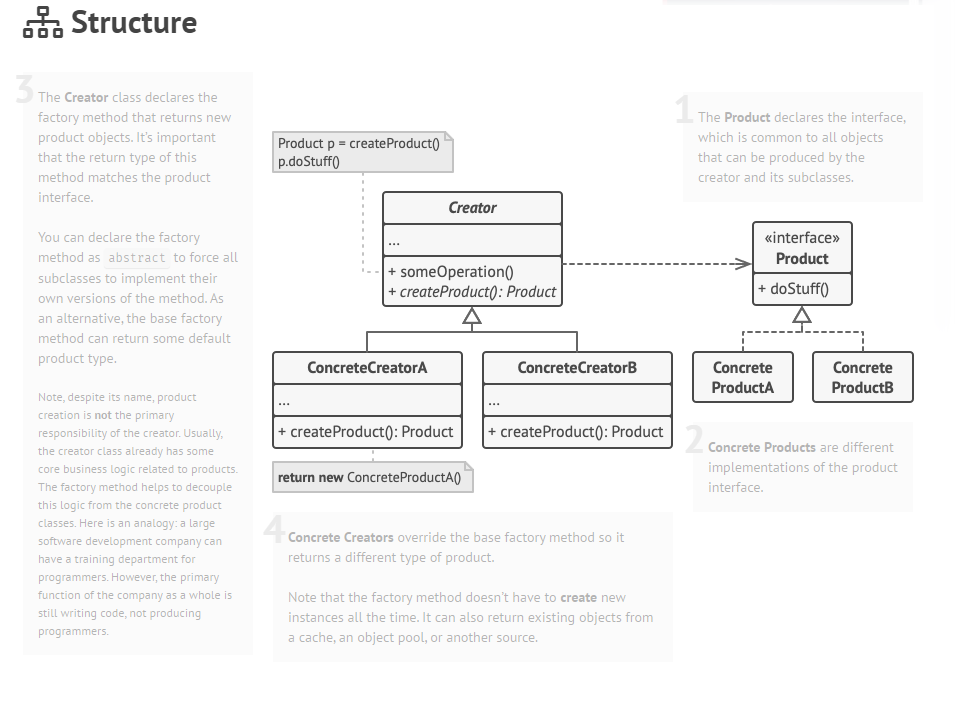
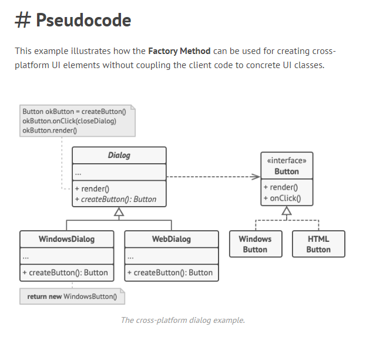

# Factory Method

The Factory Method pattern suggests that you replace direct object construction calls (using the new operator) with calls to a special factory method. Don’t worry: the objects are still created via the new operator, but it’s being called from within the factory method. Objects returned by a factory method are often referred to as **products**.

