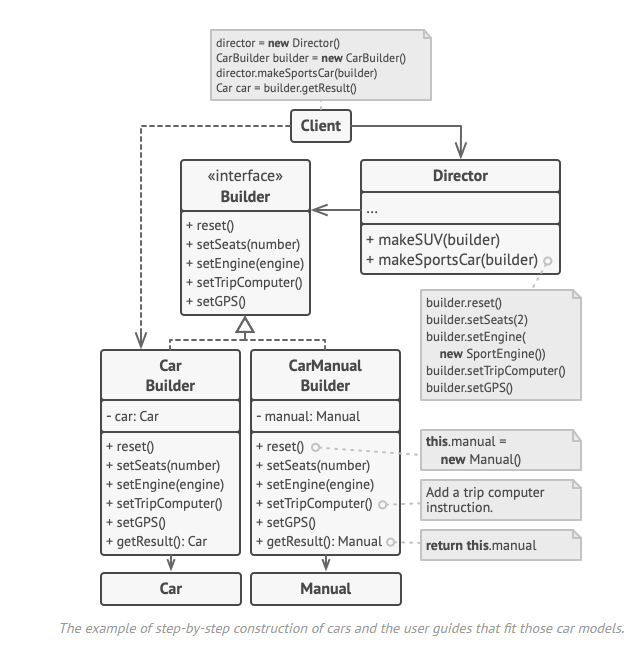

# Builder

> Padrão criacional que permite criar um objeto de maneira flexivel 
> types / representation of an object

-----

Extract the object construction or **creation code** out of its own class and move it to separate objects called **builders**

-----

1. You can construct objects step-by-step, defer construction steps or run steps recursively.
2. You can reuse the same construction code when building various representations of products.

