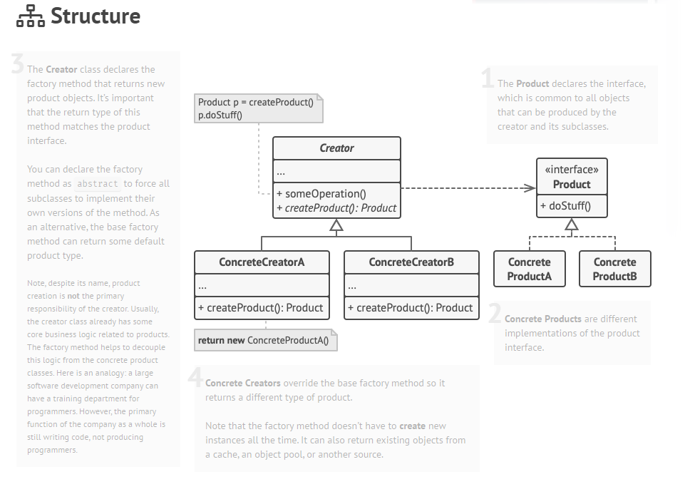
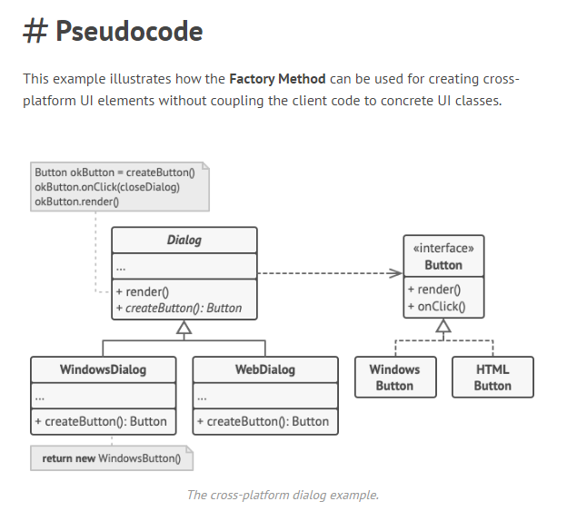

# Factory Method

### Entendimento

> O Padrão Factory Method tem o objetivo de desacoplar a criação de objetos, utilizando uma classes abstrata ou interface que delega a outras classes a lógica de instanciação, através impossição de uma interface que representa o produto, dessaforma a lógica criacional fica isoloda e a utilização se faz através do comportamento.

The Factory Method pattern suggests that you replace direct object construction calls (using the new operator) with calls to a special factory method. Don’t worry: the objects are still created via the new operator, but it’s being called from within the factory method. Objects returned by a factory method are often referred to as **products**.

