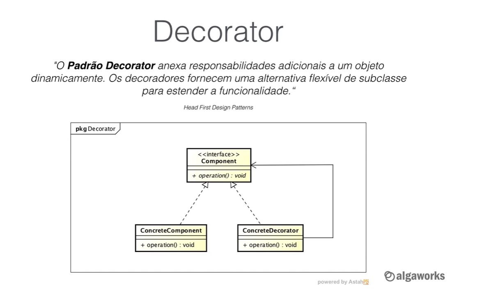

## Princípios do Desenvolvimento (SOLID)

- Single Responsibility
- Open-Closed
- L -
- I -
- D -

### Principais Design Patterns Aplicado com Java

> São códigos para resolver problemas de design comuns, e através
> do "bad smells" são identificados

> **GOF**: Gang of four - Design Patterns: Elements of Reusable
> Object-Oriented Software

- Testes automatizados são utilizados para garantir que a
  refatoração do código não irá gerar algum bug

#### Categorias

1. Criação
    1. Factory Method
    2. Builder
    3. Abstract Factory
2. Estrutura
    1. Proxy
3. Comportamento
    1. Observer

#### Proxy

Util quando um processo acessa muitos arquivos

Adicionar uma nova funcionalidade ao objeto
