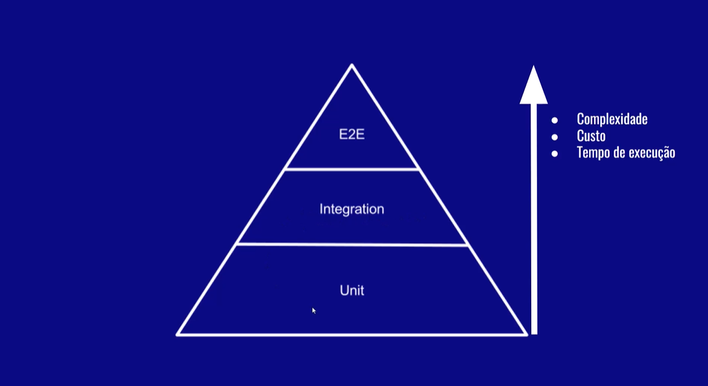
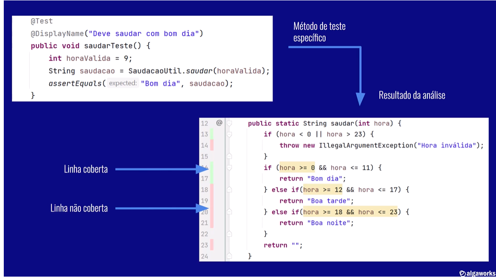
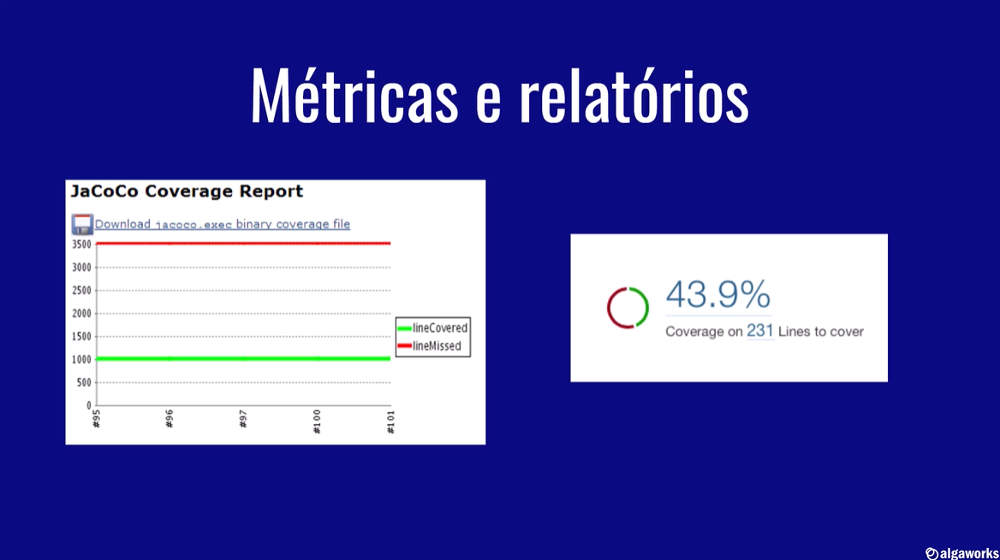

## Hierarquia de Testes

- Testes manuais demoram e são chatos 
- Agiliza o teste de uma aplicação
- Evita que bugs ocorram ao alterar o código
- Documenta as funcionalidades do sistema, assim como as regras
- O testes dão mais segurança para refatoramento

### O Princípio FIRST
1. Fast: Teste unitários devem ser rápidos (segundos/milisegundos)
2. Independent: Testes unitários devem ser indepentes
3. Repeatable: Testes unitários devem permitir repetição
4. Self-validating: Testes devem ter autoavaliação
5. Timely: Testes devem ser escritos junto ao desenvolvimento
6. Thorough: Testes devem ser minuciosos

### Padrão Triple A
 - Arrange (Prepara)
 - Act     (Executa)
 - Assert  (Verifica)

### Nomenclatura BDD
 > Behaviour Driven Development
  - Given
  - When
  - Then

É uma boa prática seguir esse modelo ao nomear um test unitário

### Design Pattern Object Mother
 > Design muito utilizado em testes

#### Ferramentas de análise de cobertura

 - Intellij
 - Jaccoco (Java Code Coverage Library)

